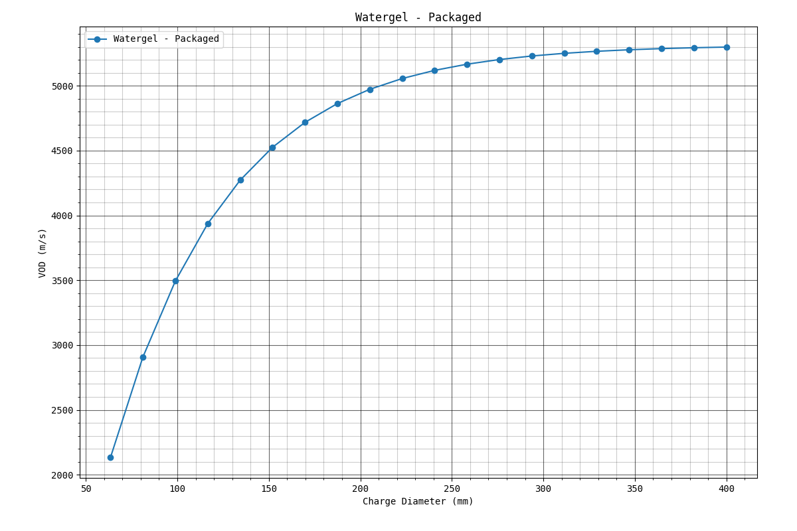
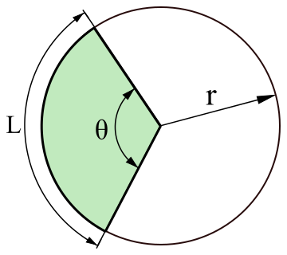

---
UUID: 17263a7e-b5c1-11eb-9fb7-a3fe2da49343

title: Images
language: en

version_created:
  date: 2021-05-15
  user: 2021.1
...

# Images {#sec:ch0_1_images-1}

It should be possible to accommodate local images stored with relative and absolute paths as well as images stored remotely. It doesn't make much sense in the work that we are doing to use images stored remotely. In any case, it should be possible to number the figures in a consistent manor, whether they are remote or local.

We will be using the syntax from [pandoc-fignos](https://github.com/tomduck/pandoc-fignos) to define the figure number and references that we'll use.

## [pandoc-fignos](https://github.com/tomduck/pandoc-fignos) Usage

To mark a figure for numbering, add an identifier to its attributes:
```
{#fig:id}
```

The prefix `#fig:` is required. id should be replaced with a unique string composed of letters, numbers, dashes and underscores. If id is omitted then the figure will be numbered but unreferenceable. Alternatively, reference link attributes may be used.

To reference the figure, use:
```
@fig:id
```

or:
```
{@fig:id}
```

Curly braces protect a reference and are stripped from the output.

### Clever References

Writing markdown like
```
See fig. @fig:id.
```

seems a bit redundant. Pandoc-fignos supports "clever references" via single-character modifiers in front of a reference. Users may write

```
 See +@fig:id.
```

to have the reference name (i.e., "fig.") automatically generated. The above form is used mid-sentence; at the beginning of a sentence, use:
```
 *@fig:id
```

instead. If clever references are enabled by default (see Customization, below), then users may disable it for a given reference using:
```
!@fig:id
```

### Tagged Figures

The figure number may be overridden by placing a tag in the figure's attributes block:

```
{#fig:id tag="B.1"}
```

The tag may be arbitrary text, or an inline equation such as `$\text{B.1}'$`. Mixtures of the two are not currently supported.

### Disabling Links

To disable a link on a reference, set nolink=True in the reference's attributes:

```
@fig:id{nolink=True}
```

## Examples

<!-- Use the pandoc-fignos syntax for marking figures up...  -->
<!-- {#fig:id} this goes at the end of the image link. -->
<!-- id should be replaced with a unique string composed of letters, numbers, dashes and underscores. -->
<!-- For me, I will use the name of the document and numbers. "ch0_preamble-1" -->
<!-- NOTE: You can specify height and width of the image - https://stackoverflow.com/questions/14675913/changing-image-size-in-markdown -->


{#fig:ch0_1_images-1 width=100%}

<!-- **\*@fig:ch0_1_images-1** - This is a sample image representing the VOD curve of a packaged Watergel explosive. -->

{#fig:ch0_1_images-2}

<!-- **\*@fig:ch0_1_images-2** - Definition of a circular arc. -->