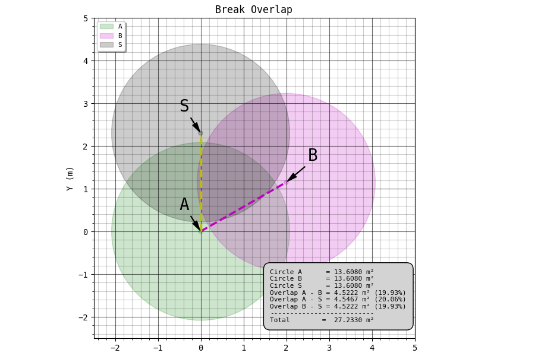

---
UUID: 77d83138-b5c1-11eb-9fb7-a3fe2da49343

title: Sections
language: en

version_created:
  date: 2021-05-15
  user: 2021.1
...

# Sections {#sec:ch0_4_sections-1}

Instead of referencing documents, it would be best to reference sections. That way the names don't really matter at all as long as the id's are unique. Pandoc will automatically generate identifier's for each section it encounters. This is fine if the section titles are unique, but having the document spread across multiple files (even within the same document) doesn't guarantee it. In most cases it is probably only required to create a specific section identifier for the required sections and leave it at that - minimize the surface so-to-speak.

## [pandoc-secnos](https://github.com/tomduck/pandoc-secnos) Usage {#sec:ch0_4_sections-1.usage}

To reference a section, use:

```
@sec:id
```

or:

```
{@sec:id}
```

The prefix `@sec:` is required. `id` should be replaced with a unique identifier for the section, composed of letters, numbers, dashes and underscores. Curly braces protect a reference and are stripped from the output.

Pandoc automatically assigns an identifier to each section title in a document. For example, the identifier for

```
Section One
===========
```

is section-one; a reference to it would be `@sec:section-one`. An identifier may be explicitly assigned to the section title using attributes as follows:

```
Section Two {#sec:2}
===========
```

A reference to this would be `@sec:2`. 


```
See sec. @sec:id.
```

`pandoc-secnos` supports "clever references". Instead, you can write:

```
 See +@sec:id.
```

At the beginning of a sentence:

```
 *@sec:id
```

Disable a clever reference:

```
!@sec:id
```

>Note: When using `*@sec:id` and emphasis (e.g., *italics*) in the same sentence, the `*` in the clever reference must be escaped; i.e., `\*@sec:id`.

### Disabling Links

Set the nolink attribute:

```
@sec:id{nolink=True}
```

## Example

Here is a reference to @sec:ch0_4_sections-1.usage, the section that describes how to use the references. This is an internal link. Here is a reference to the [preamble section](./ch0_0_preamble.md#sec:ch0_0_preamble-1).

### Some Images

This is section to see if the figure numbers are numbered correctly when a document is combined.

{#fig:ch0_4_sections-1 width=100%}

<!-- **\*@fig:ch0_4_sections-1** - A depiction of radial break overlap, that is how much the cracking from different blast holes overlap. -->


{#fig:ch0_4_sections-2 width=100%}

<!-- **\*@fig:ch0_4_sections-2** - Hyperbolic break, another way to view the reflection of the shock-wave from the free face. -->


### Some Equations

Vector in matrix form:
$$v = \begin{pmatrix} \alpha_1 & \alpha_2  & \alpha_3  & 0 \end{pmatrix} \begin{pmatrix} v_1\\ v_2\\ v_3\\ P_0\end{pmatrix}$$ {#eq:ch0_4_sections-1}

Point in matrix form:
$$P = \begin{pmatrix} \alpha_1 & \alpha_2  & \alpha_3  & 1 \end{pmatrix} \begin{pmatrix} v_1\\ v_2\\ v_3\\ P_0\end{pmatrix}$$ {#eq:ch0_4_sections-2}