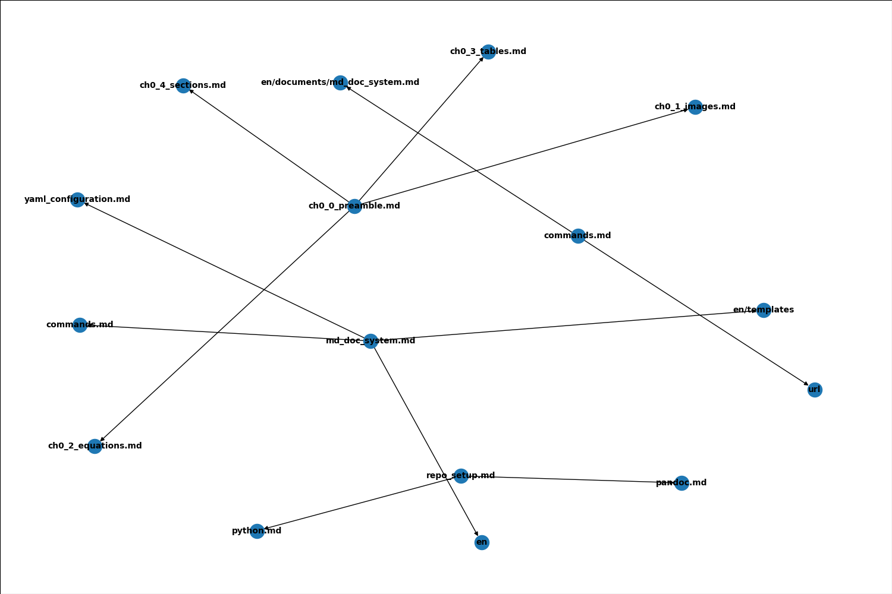

---
UUID: fc1a110c-c0a0-11eb-9373-adebb1fb324c

title: Commands
language: en

version_created:
  date: 2021-05-29
  user: 2021.1
...

# Commands

The system has a number of different commands that can be executed at the terminal. Operating the build system can be as easy as using a `makefile` or with a few more steps, the commands can be executed from within the virtual environment.

## Make

For Linux based systems a [makefile](https://www.gnu.org/software/make/) is provided. It wraps some of the basic command line tools to manage the document repository and the build system. 


`make` - Ensure the the virtual environment is available. If it isn't present it will be created and all packages will be installed automatically. The command:

```
$ make
```

`make clean` - Clean out any transformed documentation (HTML, PDF, etc.). The command:

```
$ make clean
```

`make remove` - Delete the virtual environment and clear any cached files. The command:

```
$ make remove
```

`make test` - Run the unit tests:

```
$ make test
```

Build the documents:

```
$ make html

$ make pdf

$ make single
```

# Build and Docs

md_docs comes with a set of build and documentation tools to make it easier to transform your documentation and repair issues with them.

## Build

The build tools are the heart of the system. They will take your Markdown documents and transform them to the final output format. 

>NOTE: Currently the build tool is setup to build to PDF and HTML with more focus and emphasis on multiple HTML, that is a one-to-one conversion of a Markdown file to the equivalent HTML.

### HTML and PDF

With the virtual environment active[^1], you can initiate a build process with the following command:


```bash
$ build [OPTIONS] command [ARGS]
```
[^1]: Use the command `$ . .venv/bin/activate` on linux or `$ .venv\Scripts\activate.ps1` on windows.

The following options are available:

- `--config` 
    - Pass in the configuration file to control the process. You can pass in multiple files by calling the switch multiple times. The order you pass the files in matters. Any duplicate values will be overwritten by the last file.

At this time there is only one option, and it isn't optional. At least one configuration file must be specified. The configuration file is a [YAML file](en/documents/md_doc_system.md#yaml-configuration-files) that instructs the build process.

The available commands for `build` are:

- `html` 
    - Available optional argument: `--single`. Merge all HTML files into a single HTML file.
- `pdf`
    - Available optional argument: `--latex`. Generate raw Latex instead of a PDF. Useful for debugging errors.

Here is a set of commands that can be used to build the sample documentation and instructions for md_docs:

```bash
$ build \
    --config=en/config.common.yaml \
    --config=en/config.ignore.yaml \
    --config=en/config.html.yaml \
    html

$ build \
    --config=en/config.common.yaml \
    --config=en/config.ignore.yaml \
    --config=en/config.html.yaml \
    html --single
```

Here are the commands to create a PDF file from the documentation (provided you have the PDF dependencies installed and configured correctly):

```bash
$ build \
    --config=en/config.common.yaml \
    --config=en/config.pdf.yaml \
    pdf

$ build \
    --config=en/config.common.yaml \
    --config=en/config.pdf.yaml \
    pdf --latex

```

>NOTE: There is also a [Makefile](#make) in the repository to automate the process.


## Docs

Similar to the [`build`](#build) scripts, the `docs` help maintain the document repository. It has a number of tools that can assist with the process. 

>NOTE: The `docs` command will not transform your documentation to a different format. It is strictly for diagnosis and validation of the Markdown and `LST` files in the system.

### Validate

The `validate` command will examine the Markdown files and perform the following checks:

- Absolute URL check
    - Will attempt to connect to the remote URL and report any issues with the URL
- Relative URL check
    - Determine if the resource exists locally and report if it doesn't
- Image URL check
    - Determine if the local image resource exists and report if it doesn't
- YAML Block check
    - Checks to see if the Markdown contains a valid YAML block
    - Checks if the UUID is within the YAML block and has a value.
    - Checks for duplicate UUID
    - Checks for UUID that are not 36 characters long

The `validate` option, requires the basic configuration file used for the system. Generally only the configuration for the system and not the ones specific to any output format is required. The `markdown` option will search the system for all of the Markdown files (defined by the configuration file) and perform the checks on them. 

To run the Markdown validation, use the following command:

```bash
$ docs --config=./en/config.common.yaml validate markdown
```

Output:

```markdown
Searching for markdown and LST files...
736 Markdown files were found...
18 LST files were found...

Validating Markdown Files...

Issues in `release_notes/index.md`:
URL Issues
release_notes/index.md - line 52 - `[here](toc.md)` - Broken - Relative Link.

-----
Issues in `analyzer/comparisons/comparison_window.md`:
URL Issues
analyzer/comparisons/comparison_window.md - line 12 - `[resolution](main_toolbar_1.md#id_2)` - Broken - Relative Link.

-----
Issues in `analyzer/advanced_costing.md`:
Image Issues
Issues in `release_notes/2018/v4_053_071_150_2018_05_30.md`:
URL Issues
analyzer/advanced_costing.md - line 22- `` - Broken - Relative Image Link.
release_notes/2018/v4_053_071_150_2018_05_30.md - line 15 - `[break module](../../analyzer/break/break.md)` - Broken - Relative Link.

-----

-----
Issues in `designer/dbadmin/explosive_window.md`:
URL Issues
designer/dbadmin/explosive_window.md - line 18 - `[here](_toolbar_12.md)` - Broken - Relative Link.

-----

-----
Started  - 2021-05-28 16:01:34.504272
Finished - 2021-05-28 16:01:35.797465
Elapsed:   0:00:01.293193
```

From the output, above, you can see a number of issues were discovered.


The `lst` option will search for all `LST` files and determine if there are missing Markdown files, i.e. Markdown files that are in the system but not covered by at least one of the `LST` files in the system. In most cases, you probably don't want a Markdown file in the system that isn't mentioned in one of the `LST` files. 

Here is a sample command line argument to activate the `LST` validation option:


```bash
$ docs --config=./en/config.common.yaml validate lst
```

Output:

```markdown
Searching for markdown and LST files...
736 Markdown files were found...
18 LST files were found...

Validating LST Files...

all.lst
release_notes/release_notes.lst
release_notes/2016/2016.lst
release_notes/2019/2019.lst
release_notes/2018/2018.lst
release_notes/2015/2015.lst
release_notes/2017/2017.lst
release_notes/2020/2020.lst
release_notes/2014/2014.lst
release_notes/older/older.lst
analyzer/analyzer.lst
analyzer/cms_field_fit/cms_field_fit.lst
analyzer/comparisons/comparisons.lst
analyzer/break/break.lst
designer/designer.lst
designer/dbadmin/dbadmin.lst
designer/aegis/aegis.lst
designer/reports/reports.lst
Check - Are all markdown files accounted for in the LST files....
MD Files (lst): 735
MD files (file system): 736

Files that are in the FILE SYSTEM but not in the set of LST files:
    ~/en/documents/index.md

Count: 1
```

From the output we can see that one Markdown file isn't covered by any of the `LST` files. In this case, it is an `index.md` which is a place holder and will be fully populated by the system automatically. In this case it is optional and we can ignore it.

### Graph

The `graph` command takes the `LST` file and plots the graph ([DAG](https://en.wikipedia.org/wiki/Directed_acyclic_graph)) showing all the document inter-connections.

```bash
$ docs --config=./en/config.common.yaml graph ./en/documents/sites.lst
```




The graph can help to make sure that your site is inter-connected properly and diagnose issues.


### Stats

The `stats` command displays the word count for each of the Markdown files in the system and provides a total word count for the entire system.

```bash
$ docs --config=./en/config.common.yaml stats
```


```markdown
Counted general_symbols.md -> 146 words...
Counted scale_bar_item.md -> 43 words...
Counted rounding_options.md -> 79 words...

-----
Started  - 2021-05-28 17:03:53.657118
Finished - 2021-05-28 17:03:56.177413
Elapsed:   0:00:02.520295

Total Documents:      736
Total Words:      182,584
Estimated Pages:    365.2
```

>NOTE: The page count is an approximation assuming 500 words per page.

### Repair

The `repair` command allows you to search through the Markdown files and attempt to repair conditions. It allows you to repair:

- [Links](#links) - Attempt to repair broken relative links
- [Images](#images) - Attempt to repair broken relative images
- [Headers](#headers) - Add section attributes to the ATX headers

>NOTE: All of the repair options have a `--dry-run` option available. This option will show you what would happen and what files would be altered.

>NOTE: Not all problems this tool reports can be fixed by this tool.

>NOTE: It is assumed that all relative links are relative to the document they are located in.

#### Links

The `links` option will scour all the Markdown documents defined by configuration file. It will determine if they contain relative links and if those relative links are broken. If it can fix the issue it will.

Assumptions:

- Only looks at Markdown Links of the form: `[text](url)`
- Only examines relative links

How a broken link is handled:

- If it finds a broken relative Markdown link, it will examine the file system to see if there is an exact match for the file name on some other path. 
    - If it finds a single match, it will use that match to fix the broken link. 
- If it finds multiple matches it simple reports them. The user will have to correct the link(s) manually. 
- If there is no exact match, it attempts to find close matches and provides suggestions to potential fixes. The user would have to make the correction(s) manually.


An example of using the repair command to search for broken links:

```bash
$ docs --config=./en/config.common.yaml repair --dry-run links
$ docs --config=./en/config.common.yaml repair links
```

Output:

```
Searching for Markdown files...
736 Markdown files were found...

Processing Markdown File Links...

------
NO MATCHES
The following files had no matches or any close matches within the system.

File: release_notes/index.md
Line: 52 -> `[here](toc.md)`

File: release_notes/2016/v0_20_082_0830_2016_08_30.md
Line: 17 -> `[dongle](../../designer/license/dongle_issue_window.md)`

File: release_notes/2018/v4_053_071_150_2018_05_30.md
Line: 15 -> `[break module](../../analyzer/break/break.md)`

------
SUGGESTIONS
The following files did not have any exact matches within the system but they had some close matches.

File: analyzer/comparisons/comparison_window.md
Line: 12 -> `[resolution](main_toolbar_1.md#id_2)`
1. -> designer/dbadmin/toolbar_1.md
2. -> designer/aegis/toolbar_1.md
3. -> analyzer/break/toolbar_13.md
4. -> analyzer/break/toolbar_12.md

------
Started  - 2021-05-28 17:17:24.109992
Finished - 2021-05-28 17:17:24.456648
Elapsed:   0:00:00.346656
```

#### Images

The `images` option will examine the Markdown documents and determine if the image links have a problem and attempt to fix them.

Assumptions:

- Only look at Markdown image links of the form: ``

How a broken link is handled:

- If it finds a broken image link and that image link is relative, it will examine the file system to see if there is an exact match for the file name. 
    - If it finds a single match, it can use the path to this file to fix it. 
- If it finds multiple matches it simple reports them The user will have to correct the link(s) manually. 
- If there is no exact match, it attempts to find close matches and suggests these as potential fixes. Corrections would have to be applied manually.

```bash
$ docs --config=./en/config.common.yaml repair --dry-run images
$ docs --config=./en/config.common.yaml repair images
```

Sample Output:

```
Searching for Markdown files...
736 Markdown files were found...

4893 images were found...

------
EXACT MATCHES
The following files have a single, exact match within the system.

File: analyzer/advanced_costing.md
Line: 22 - Replacing `../../assets/drex_advanced_costing_custom.png` -> `../assets/drex_advanced_costing_custom.png`
------DRY-RUN------

File: designer/installation.md
Line: 18 - Replacing `../../assets/drex_setup_wizard_step_1___start_screen.png` -> `../assets/drex_setup_wizard_step_1___start_screen.png`
Line: 21 - Replacing `../../assets/drex_setup_wizard_step_2___eula_screen.png` -> `../assets/drex_setup_wizard_step_2___eula_screen.png`
Line: 24 - Replacing `../../assets/drex_setup_wizard_step_3___location_screen.png` -> `../assets/drex_setup_wizard_step_3___location_screen.png`
Line: 27 - Replacing `../../assets/drex_setup_wizard_step_4___begin_installation_screen.png` -> `../assets/drex_setup_wizard_step_4___begin_installation_screen.png`
Line: 30 - Replacing `../../assets/drex_setup_wizard_step_5___completed_screen.png` -> `../assets/drex_setup_wizard_step_5___completed_screen.png`
Line: 37 - Replacing `../../assets/drex_launching_aegis_custom.png` -> `../assets/drex_launching_aegis_custom.png`
Line: 41 - Replacing `../../assets/drex_launching_aegis_custom_2.png` -> `../assets/drex_launching_aegis_custom_2.png`
------DRY-RUN------

Exact Matches - 2 files corrected!
------

------
Started  - 2021-05-28 17:19:30.117563
Finished - 2021-05-28 17:19:30.477433
Elapsed:   0:00:00.359870
```

#### Headers

The `headers` option will examine the Markdown documents for ATX headers that do not have a section attribute. The section attribute should be of the form `{#sec:c9a-ad2-c7bb_0}` and appear at the end of the header text. It will be used by Pandoc to create section anchors for HTML and PDF output.

Example section attribute:

```
# Header Title {#sec:c9a-ad2-c7bb_0}
```

The section attribute can be any random bit of text. By default, Pandoc will create a section attribute so that it can be used as an HTML anchor. However, the process does leave a bit to be desired and it is possible that duplicate headers can have nearly identical names. The idea is to provide a relatively unique id so that PDF and single HTML files will not have duplicate or nearly duplicate anchor names. It will also ensure that you can have consistent anchor names to target.

The program will calculate the SHA256 hash of the relative file path (relative to the document root) and take the first 10 characters of it and assign that as the primary anchor id. In addition it will append an monotonic integer to the name to create a unique section id, at least unique within the document and a high probability within the system.

```bash
$ docs --config=./en/config.common.yaml repair --dry-run headers
$ docs --config=./en/config.common.yaml repair headers
$ docs --config=./en/config.common.yaml repair --dry-run headers --list
```

Sample Output:

```
Searching for Markdown files...
736 Markdown files were found...

Searching for missing header attributes...

------
7/736 files have missing attributes.

File: release_notes/2014/v0_7_004_1121_2014_11_21.md
Line: 21 - Added Section Attribute: `### Designer Issues {#sec:c9a-ad2-c7bb_0}`
Line: 42 - Added Section Attribute: `### Analyzer Issues {#sec:c9a-ad2-c7bb_1}`

File: release_notes/2014/v0_7_001_1030_2014_10_30.md
Line: 18 - Added Section Attribute: `### Designer Issues {#sec:9a3-ec7-ca4d_0}`

File: release_notes/2014/v0_6_531_1030_2014_10_30.md
Line: 19 - Added Section Attribute: `### Designer Issues {#sec:1dc-4fc-0e99_0}`

File: release_notes/2014/v0_3_217_117_2014_01_17.md
Line: 12 - Added Section Attribute: `## Enhancements {#sec:129-e06-352b_0}`
Line: 39 - Added Section Attribute: `## Issues {#sec:129-e06-352b_1}`

File: release_notes/2014/v0_7_006_1212_2014_12_12.md
Line: 28 - Added Section Attribute: `### Designer Issues {#sec:64f-d8a-2d1d_0}`
Line: 65 - Added Section Attribute: `### Analyzer Issues {#sec:64f-d8a-2d1d_1}`

File: release_notes/older/v0_1_1000_767_not_released.md
Line: 12 - Added Section Attribute: `## Enhancements {#sec:182-534-95d3_0}`
Line: 21 - Added Section Attribute: `## Issues {#sec:182-534-95d3_1}`

File: release_notes/older/v0_1_1000_746_2013_08_13.md
Line: 14 - Added Section Attribute: `## Enhancements {#sec:246-562-3a25_0}`
Line: 25 - Added Section Attribute: `## Issues {#sec:246-562-3a25_1}`
------DRY-RUN------

------
Started  - 2021-05-28 17:20:20.436331
Finished - 2021-05-28 17:20:20.593770
Elapsed:   0:00:00.157439
```
